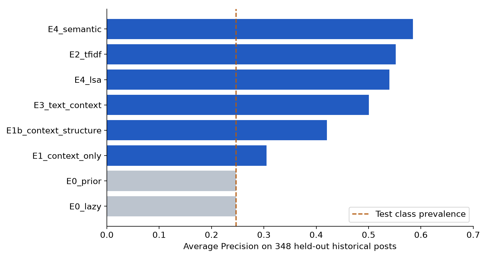
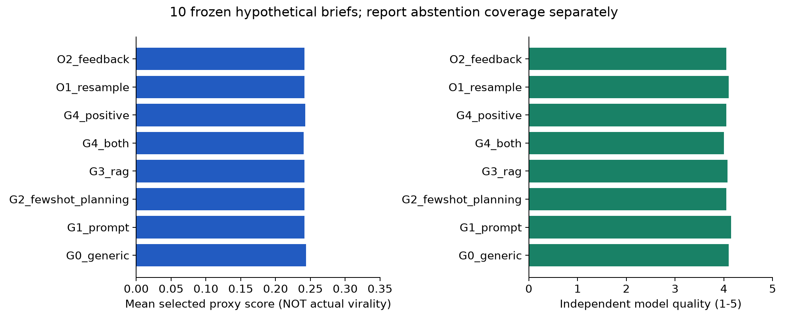

# ViralLoop — A Fact-Constrained Community Post Drafting and Evaluation Prototype

**PE6201 Emerging AI Technologies · End-of-Course Project · Final Report**
Individual work · Shen Shuo · 987 words of prose (1,471 in total once tables, figure captions and headings are counted)
Repository: https://github.com/shenshuo-03/PE6201_ViralLoop (public)

---

## 1. The problem, and why it matters

Every technical community has a minority of posts that a large audience reads, and a majority that nobody opens. The intuition behind this project was that the difference is not luck — it is *expert tacit judgement*: which detail is the hook, which fact is worth keeping, when a post is honest about its own limits. If that judgement is latent in historical content, it should be learnable and transferable.

That intuition survived contact with the data. **What did not survive was the assumption that a learnable signal can be turned into a usable generator.**

I framed the project as a closed loop: learn patterns from historical high-performing posts → predict performance → generate candidates → evaluate independently → feed the evaluation back. Three rounds of experiments later, the honest finding is that the loop did not pay for itself. This report explains why, using the real numbers.

**Scope.** Out of scope from the start: automated publishing, cross-platform virality, commercial launch, fine-tuning foundation models, and any claim about real-world engagement. This is a research prototype, not a product claim.

## 2. Why AI, and which kind

I chose **prompting a rented foundation model**, and deliberately climbed no higher than the evidence justified. The ladder I tested, and what each rung bought:

| Rung | Component | Verdict |
|---|---|---|
| Setup | Zero-shot / few-shot prompting with a structured brief | **Kept** — cheapest thing that works |
| Setup | Retrieval-augmented generation (RAG) over historical posts | No stable gain |
| Setup | Narrow ML (TF-IDF logistic regression) as a historical predictor | Kept as an *audit* tool only |
| Setup | Semantic embeddings as a predictor | Kept as an *audit* tool only |
| Setup | Self-critique / feedback loop | Closed — near-zero and negative independent audit |
| Setup | Multi-sample plus selector | Unproven, removed |
| Setup | Motivation / engagement planner | Unproven, removed |

Non-AI baselines were named and measured against, not skipped: a **lazy baseline** (always predict "not high-performing") and a **constant prior**. The course watch-out — that accuracy without a majority-class baseline says nothing — is exactly the trap this project avoided.

Which parts stay rules: the **fact, identity and date checks** are deterministic and stay as rules, together with human confirmation. Only drafting is delegated to the model.

## 3. Data

Dataset: [`pszemraj/LocalLLaMA-posts`](https://huggingface.co/datasets/pszemraj/LocalLLaMA-posts), a Reddit archive of **r/LocalLLaMA** — a single, technically demanding community, chosen so that platform and domain are held roughly constant.

From 100,679 raw posts, a rule filter produced 20,019 candidates; stratified sampling gave 2,800; a 400-post probe established the observation window; final model data was **2,336 posts**.

| Stage | N | Note |
|---|---:|---|
| Raw corpus | 100,679 | Public archive |
| Free-rule candidates | 20,019 | 2025, text-only, length/type filters |
| Stratified recovery | 2,800 | By month × type, **not** sampled by score |
| Observation audit | 400 | 95.75% found at 36–38h age |
| Final model data | 2,336 | After age-window filter and second clean |

Two data problems were solved properly rather than ignored. **Observation age:** the raw file did not guarantee equal accumulation time, so `score` and `retrieved_on` were recovered from the same source and the window was fixed at 36–38 hours. **Leakage:** the label is built from post-publication `score`; the model never sees score, comments or any post-publication field. Splits are temporal: Train (Jan–Jul, 1,396), Tune (Aug–Sep, 398), Selection (Oct, 194), **Final (Nov–Dec, 348)**.

`score` is a net-vote signal — not impressions, not clicks, not unique readers. The target is **relative high score within community and month**, not "viral".

## 4. Success metric and evaluation

Primary metric: **Average Precision (AP)** on the held-out 348 historical posts, with Precision/Recall/F1 and accuracy alongside; AP because the positive class is a minority (~24.7%) and ranking matters more than the threshold.

| Model | P | R | F1 | AP |
|---|---:|---:|---:|---:|
| Lazy baseline (always negative) | 0.000 | 0.000 | 0.000 | 0.247 |
| E1 context only | 0.291 | 0.500 | 0.368 | 0.305 |
| E1b context + structure | 0.381 | 0.593 | 0.464 | 0.420 |
| **E2 TF-IDF logistic regression** | 0.510 | 0.605 | 0.553 | **0.552** |
| E3 text + context | 0.468 | 0.686 | 0.557 | 0.500 |
| **E4 semantic embedding** | 0.451 | 0.698 | 0.548 | **0.585** |

Author-clustered bootstrap put E2's AP gain over the prior at roughly **[0.219, 0.405]** — i.e. the historical prediction signal is real.

*Figure 1 — Average Precision on the held-out final split (n = 348). The dashed line at 0.247 is both the lazy "always negative" baseline and the test-set positive prevalence. E2 (TF-IDF) and E4 (semantic) clear it by a wide margin; E1's context-only rung barely moves off the floor. This is the "predictable" half of the claim — and the only half that survived.*

## 5. The finding: prediction did not transfer to generation

Round 1 generated 180 candidates across eight arms (G0 generic, G1 prompt, G2 few-shot/planning, G3 RAG, G4 positive patterns, G4 both, O1 resample, O2 feedback), all judged by a frozen E2 and an independent quality model.

| Version | Mean E2 proxy |
|---|---:|
| G0 | 0.24355 |
| G1 | 0.24154 |
| G3 (RAG) | 0.24135 |
| G4 both | 0.24021 |
| O1 resample | 0.24157 |
| O2 feedback | 0.24171 |

The headline comparison — feedback versus equal-budget resampling — was **+0.0001395**, with a topic-bootstrap 95% interval of **[−0.0008932, +0.0009857]**. The interval contains zero. The independent historical auditor agreed: **−0.0146 [−0.0415, +0.0075]**, also containing zero.

**Complexity did not buy anything measurable.** A score of 0.244 is *not* a 24.4% virality probability; it is a proxy from a model trained on a different distribution from generated text.

*Figure 2 — The generation experiment in one picture. **Left:** mean selected E2 proxy score by arm — every arm, including RAG and the feedback loop, sits at ≈0.24, inside the interval that contains zero. **Right:** independent quality rating on a 1–5 scale — flat across arms, with the feedback arm (O2) reaching 4.20 against a 4.06–4.10 band. Neither view shows the ladder buying a usable gain, which is why the ladder was cut.*

Crucially, while the automatic scores moved within noise, the **human reaction did not**. Reviewers said drafts were too abstract and did not look like real community posts. That gap — tidy automatic scores versus a human "I would not post this" — became the project's central observation.

## 6. The real bottlenecks

**Evaluator alignment.** Round 2 built 30 controlled comparison pairs to admit or reject judges. Gemini Flash failed outright (4/15); Gemini Lite passed calibration but **failed the information-value dimension on validation (2/5)**. A 15/15 result from an external Claude judge looked strong but only meant it agreed with pairs I had constructed myself. A model judging content is **a component of the system, not a source of truth**.

**Task realism.** Round 3, Attempt 1 unified the brief around a single identity — a community member seeking advice. The result was a systematic failure: **all 8 tasks collapsed into help-seeking posts**, including source material that was plainly a release, a tutorial or a personal test. The schema, not the model, was the bug. Attempt 2 replaced it with four archetypes (question / finding / opinion / resource) and split engagement from replyability, which fixed the type collapse but not the summarising tone.

**Complexity cost.** The API bill was trivial (see §7). The real cost was interpretive: reconciling versions, checking source identity, repairing briefs by hand, and asking a human to judge highly technical content in a second language.

## 7. Cost

| Round | Ledger entries | Tokens | API cost (US$) |
|---|---:|---:|---:|
| Round 1 | 350 | 1,403,922 | 0.3442 |
| Round 2 v002 | 500 | 1,230,780 | 0.7087 |
| Round 3 (both attempts) | 146 | 415,588 | 0.2639 |
| **Total (original three rounds)** | **996** | **3,050,290** | **1.3168** |

Round 2 exceeded its declared 1,000,000-token cap by ~23%, and 11 manifests plus 68 raw responses were missing — the protocol audit returns **FAIL**. These results are reported with that caveat attached, not hidden.

## 8. Risks, limitations and responsible use

| Risk | Mitigation actually built |
|---|---|
| Confidently fabricated claims | Fact red-lines in the prompt; deterministic source and date checks; abstention on insufficient material |
| Third-party experience written as first-person | Required `speaker_role`; independent identity audit (14/16 passed in Attempt 1, failures held as evidence) |
| Over-stated conclusions | Explicit boundary notes; no probability output shown to users |
| Silent failure — plausible but wrong post shipped | **Not fully mitigated.** Human confirmation is mandatory; no automated publish path exists |
| Third-party text rights | Dataset is ODC-BY, but Reddit author text may carry separate rights; no redistribution for commercial use |

The system is **intended for** drafting assistance with a real human author's own material and intent. It is **not intended for** automated publishing, engagement farming, or any inference about a person. Frameworks consulted: Singapore's **IMDA Model AI Governance Framework** for human-in-the-loop accountability, and the **OWASP Top 10 for LLM Applications (2025)** for prompt-injection handling (source material is treated as data, never as instructions).

## 9. Final product decision

The defensible product is **not** the closed loop. It is:

> A research prototype that turns a real author's intent and dated source material into a fact-constrained draft, with explicit rule checks and mandatory human confirmation. The closed loop is retained as a research asset, not as the default path.

This is a decision made from evidence, not from failure to build the loop. **The bottleneck was never how much machinery to add; it was whether the task was real and whether the measuring stick was calibrated.** In these three rounds, neither was established well enough for any component comparison to be interpretable — and establishing them first is what a next iteration should do.

**The most useful thing this project produced is a negative result with the receipts attached.**
